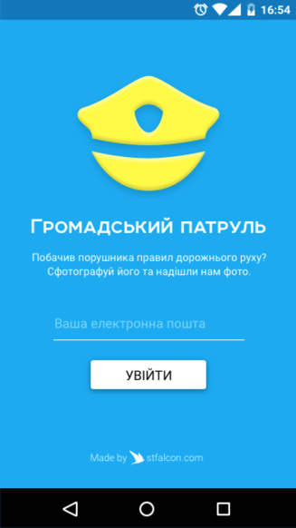

# Patrol for Android

[](https://play.google.com/store/apps/details?id=com.stfalcon.hromadskyipatrol)

### Project description
An application for video registration of traffic rules violations. You can use this like video registrator. App`s can automaticaly send violations to our server.

<p align="center">

</p>

### Features
* Video registrator mode for recording last 20 sec after tap;
* Video record in usual mode;
* Sending violation to the server side;

### Who we are
Need iOS and Android apps, MVP development or prototyping? Contact us via info@stfalcon.com. We develop software since 2009, and we're known experts in this field. Check out our [portfolio](https://stfalcon.com/en/portfolio) and see more libraries from [stfalcon-studio](https://stfalcon-studio.github.io/).

Please, contact us via github@stfalcon.com if you have some proposition for project future :)
Thank you!

### License

```
Copyright (C) 2017 stfalcon.com

Licensed under the Apache License, Version 2.0 (the "License");
you may not use this file except in compliance with the License.
You may obtain a copy of the License at

http://www.apache.org/licenses/LICENSE-2.0

Unless required by applicable law or agreed to in writing, software
distributed under the License is distributed on an "AS IS" BASIS,
WITHOUT WARRANTIES OR CONDITIONS OF ANY KIND, either express or implied.
See the License for the specific language governing permissions and
limitations under the License.

```
